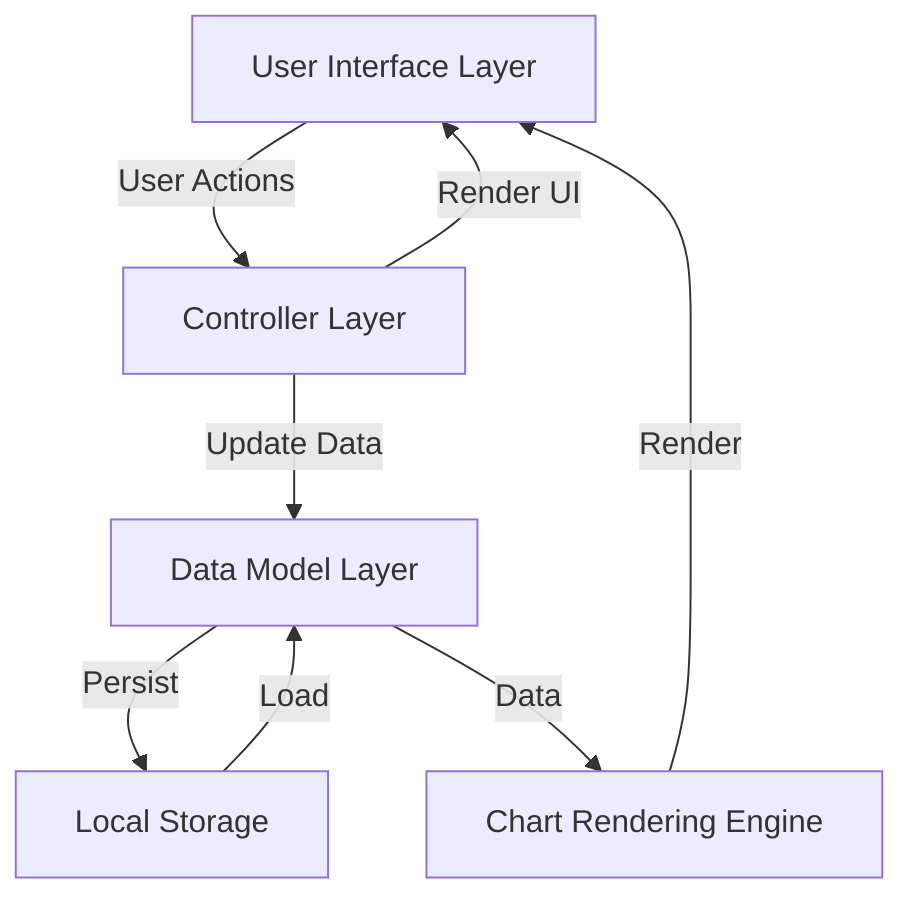

# Design Document: Expense & Budget Visualizer

## Overview

The Expense & Budget Visualizer is a client-side web application built with vanilla JavaScript, HTML, and CSS. The application provides a complete expense tracking solution with visual analytics, running entirely in the browser without requiring a backend server.

The system follows a Model-View-Controller (MVC) pattern adapted for vanilla JavaScript:

- **Model**: Transaction data and business logic for calculations
- **View**: DOM manipulation and rendering logic
- **Controller**: Event handlers and coordination between model and view

Key architectural decisions:

- **No framework dependency**: Pure vanilla JavaScript ensures minimal bundle size and maximum browser compatibility
- **Local Storage persistence**: All data stored client-side eliminates server infrastructure needs
- **Component-based organization**: Logical separation of concerns despite single-file constraint
- **Event-driven updates**: Centralized state management with observer pattern for UI synchronization

## Architecture

### System Components



### Component Responsibilities

**TransactionManager** (Model)

- Maintains in-memory transaction collection
- Provides CRUD operations for transactions
- Calculates balance and category totals
- Validates transaction data

**StorageService** (Persistence)

- Serializes/deserializes transaction data to JSON
- Manages Local Storage read/write operations
- Handles custom categories persistence
- Stores user preferences (theme, spending limit, sort order)

**UIController** (Controller)

- Handles form submission and validation
- Coordinates between model and view layers
- Manages event listeners
- Triggers UI updates on data changes

**TransactionView** (View)

- Renders transaction list with delete controls
- Updates balance display
- Handles sorting UI
- Manages monthly summary view

**ChartRenderer** (View)

- Generates pie chart visualization using Canvas API
- Calculates segment angles and colors
- Handles responsive chart sizing
- Displays empty state when no data exists

**ThemeManager** (View)

- Toggles between dark and light mode
- Applies CSS class changes
- Persists theme preference

### Data Flow

1. **Transaction Addition Flow**:
   - User fills form → UIController validates → TransactionManager adds → StorageService persists → Views update (list, balance, chart)

2. **Transaction Deletion Flow**:
   - User clicks delete → UIController handles event → TransactionManager removes → StorageService updates → Views refresh

3. **Application Load Flow**:
   - Page loads → StorageService retrieves data → TransactionManager initializes → All views render initial state

4. **Sort/Filter Flow**:
   - User selects sort option → UIController updates sort state → TransactionView re-renders with sorted data

## Components and Interfaces

### TransactionManager

```javascript
class TransactionManager {
  constructor()
  addTransaction(item, amount, category): Transaction
  deleteTransaction(id): boolean
  getTransactions(): Transaction[]
  getBalance(): number
  getCategoryTotals(): Map<string, number>
  getSortedTransactions(sortBy, order): Transaction[]
  getTransactionsByMonth(year, month): Transaction[]
  getMonthlyTotals(): Map<string, number>
}
```

**Responsibilities**:

- Maintain transaction array in memory
- Generate unique IDs for transactions
- Validate transaction data before creation
- Perform balance calculations
- Aggregate spending by category
- Filter and sort transactions

### StorageService

```javascript
class StorageService {
  static KEYS = {
    TRANSACTIONS: 'expense_transactions',
    CATEGORIES: 'expense_categories',
    THEME: 'expense_theme',
    SPENDING_LIMIT: 'expense_limit',
    SORT_PREFERENCE: 'expense_sort'
  }

  saveTransactions(transactions): void
  loadTransactions(): Transaction[]
  saveCategories(categories): void
  loadCategories(): string[]
  saveTheme(theme): void
  loadTheme(): string
  saveSpendingLimit(limit): void
  loadSpendingLimit(): number | null
  saveSortPreference(sortBy, order): void
  loadSortPreference(): {sortBy, order}
}
```

**Responsibilities**:

- Serialize data to JSON format
- Handle Local Storage API calls
- Provide error handling for storage quota exceeded
- Manage multiple storage keys for different data types

### UIController

```javascript
class UIController {
  constructor(transactionManager, storageService)

  init(): void
  handleFormSubmit(event): void
  handleDeleteTransaction(id): void
  handleSortChange(sortBy): void
  handleMonthSelect(year, month): void
  handleThemeToggle(): void
  handleSpendingLimitSet(limit): void
  handleCategoryAdd(categoryName): void

  updateAllViews(): void
  showValidationError(message): void
}
```

**Responsibilities**:

- Initialize application on page load
- Bind event listeners to DOM elements
- Validate form inputs
- Coordinate updates across all view components
- Handle user interactions

### TransactionView

```javascript
class TransactionView {
  renderTransactionList(transactions): void
  renderBalance(balance, limit): void
  renderMonthlyView(monthlyData): void
  clearForm(): void
  showError(message): void
  hideError(): void
  updateSortIndicator(sortBy, order): void
}
```

**Responsibilities**:

- Generate transaction list HTML
- Update balance display with limit indicators
- Render monthly summary interface
- Display validation errors
- Show/hide UI elements based on state

### ChartRenderer

```javascript
class ChartRenderer {
  constructor(canvasElement)

  render(categoryTotals): void
  clear(): void
  renderEmptyState(): void
  calculateSegments(categoryTotals): Segment[]
  drawPieChart(segments): void
  drawLegend(segments): void
}
```

**Responsibilities**:

- Use Canvas 2D API for chart rendering
- Calculate pie segment angles from category totals
- Assign distinct colors to categories
- Draw legend with category names and percentages
- Handle responsive canvas sizing

### ThemeManager

```javascript
class ThemeManager {
  constructor(storageService)

  init(): void
  toggleTheme(): void
  applyTheme(theme): void
  getCurrentTheme(): string
}
```

**Responsibilities**:

- Toggle CSS classes on document root
- Load saved theme preference
- Persist theme changes

## Data Models

### Transaction

```javascript
{
  id: string,           // UUID or timestamp-based unique identifier
  item: string,         // Transaction description (non-empty)
  amount: number,       // Transaction amount (positive number)
  category: string,     // Category name (from default or custom)
  timestamp: number     // Unix timestamp for creation time
}
```

**Validation Rules**:

- `id`: Must be unique across all transactions
- `item`: Required, non-empty string, trimmed of whitespace
- `amount`: Required, positive number, validated as numeric
- `category`: Required, must exist in available categories
- `timestamp`: Auto-generated on creation, immutable

### Category

```javascript
{
  name: string,         // Category name
  color: string,        // Hex color code for chart display
  isCustom: boolean     // True for user-created categories
}
```

**Default Categories**:

- Food: #FF6384
- Transport: #36A2EB
- Fun: #FFCE56

**Custom Category Rules**:

- User-defined categories stored separately in Local Storage
- Custom categories persist across sessions
- Custom categories appear in dropdown alongside defaults

### Application State

```javascript
{
  transactions: Transaction[],
  categories: Category[],
  theme: 'light' | 'dark',
  spendingLimit: number | null,
  sortPreference: {
    sortBy: 'date' | 'amount' | 'category',
    order: 'asc' | 'desc'
  },
  currentView: {
    type: 'all' | 'monthly',
    month: number | null,
    year: number | null
  }
}
```

### Local Storage Schema

**Key: `expense_transactions`**

```json
[
  {
    "id": "1234567890",
    "item": "Grocery shopping",
    "amount": 45.5,
    "category": "Food",
    "timestamp": 1704067200000
  }
]
```

**Key: `expense_categories`**

```json
["Food", "Transport", "Fun", "Healthcare", "Entertainment"]
```

**Key: `expense_theme`**

```json
"dark"
```

**Key: `expense_limit`**

```json
500
```

**Key: `expense_sort`**

```json
{
  "sortBy": "amount",
  "order": "desc"
}
```

## Correctness Properties

*A property is a characteristic or behavior that should hold true across all valid executions of a system—essentially, a formal statement about what the system should do. Properties serve as the bridge between human-readable specifications and machine-verifiable correctness guarantees.*

### Property 1: Transaction Creation with Valid Input

*For any* valid transaction data (non-empty item name, positive amount, valid category), submitting the form should result in a new transaction being added to the transaction list.

**Validates: Requirements 1.3, 1.4**

### Property 2: Form Clearing After Submission

*For any* valid transaction submission, the input form fields should be cleared after the transaction is successfully added.

**Validates: Requirements 1.5**

### Property 3: Invalid Input Prevention

*For any* transaction submission where at least one required field is empty or invalid, the application should prevent transaction creation and the transaction list should remain unchanged.